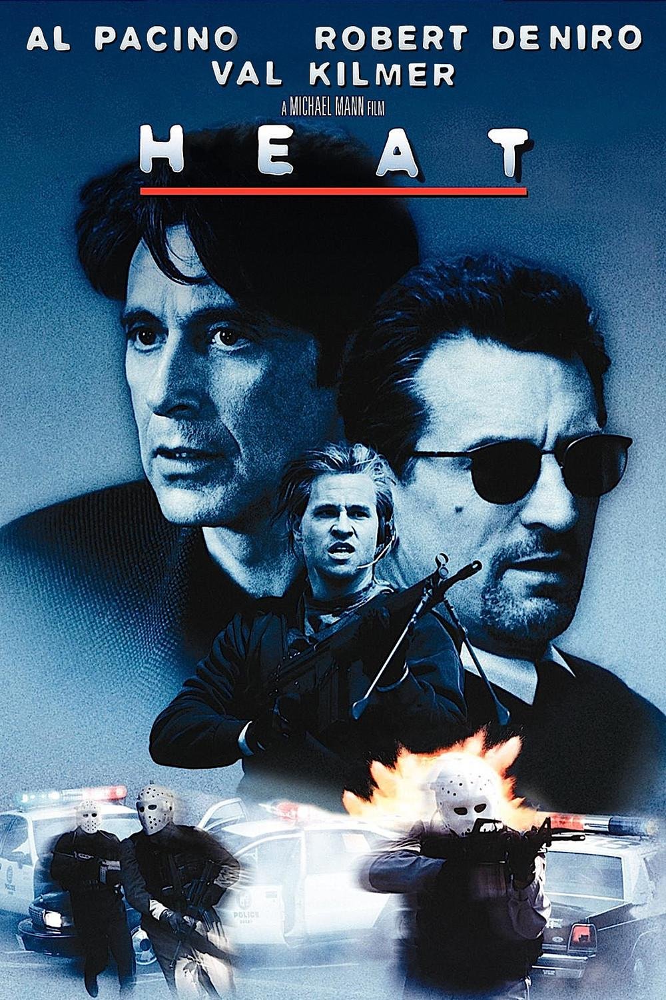
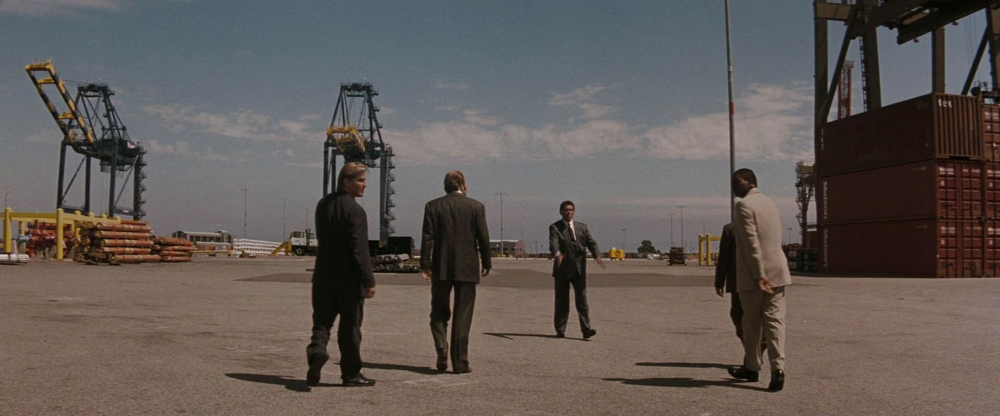
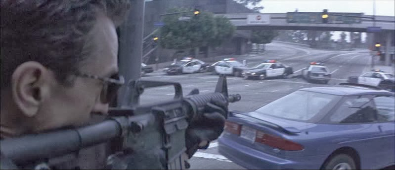
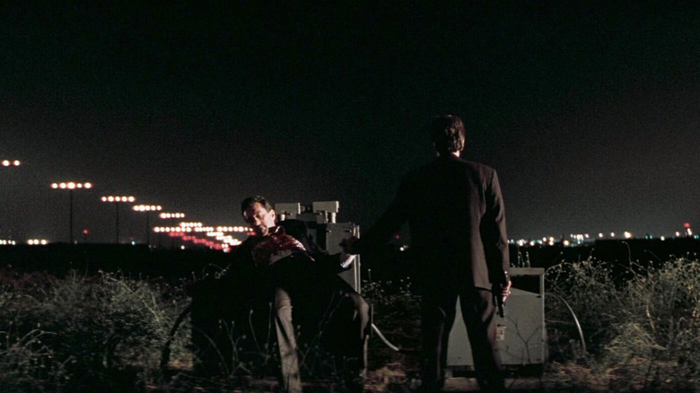

# Oh My God

##   

* * *

* * *

* * *

* * *

* * *

* * *

* * *

* * *

* * *

### Aight sick lets go

### The Review:

* * *

First of all, the visuals:  
Heat is WIDE and EMPTY and it is awesome. The absurd aspect ratio that persists for the entire movie, the framing of actors in the center of barren in-focus landscapes.  
  
This emptiness is essential to communicating the primary mode of nearly every character in this film: focus. Everyone is teeth-grindingly drilling into a singular goal. No one else is present, because it wouldn't matter if they were.  
  
The Miami Vice lighting contributes further to this unreality, cementing this city as nothing more than a fantastical arena for Vincent and Neil to push against each other to their absolute limit.  
  
Even in the climactic firefight, police and Neil's crew fire indiscriminantly at each other amongst seas of innocent bystanders. Vincent makes the attempt to push the people around him beneath the line of fire, but only in between taking potshots at the fleeing criminals, never shaking his focus even as his collegues are mortally wounded around him.
### Whats this movie about though

* * *

Heat is about the tragedy of being a perfect, flawless force of action that inhabits the body of a man.

Heat is about Vincent and Neil.

For these people, isolation is the only possible mode of operation, anything else is a fantastically doomed notion.

The tragedy is not that they *have* to drop everything when they see the heat around the corner, its that they *cant*.

When Vincent and Neil meet, we see both, for the first time, find an equal. In a sea of stationary dolls, these are two real human beings straining forwards as fast as they can.

And then, for the same reason, it has to end.
